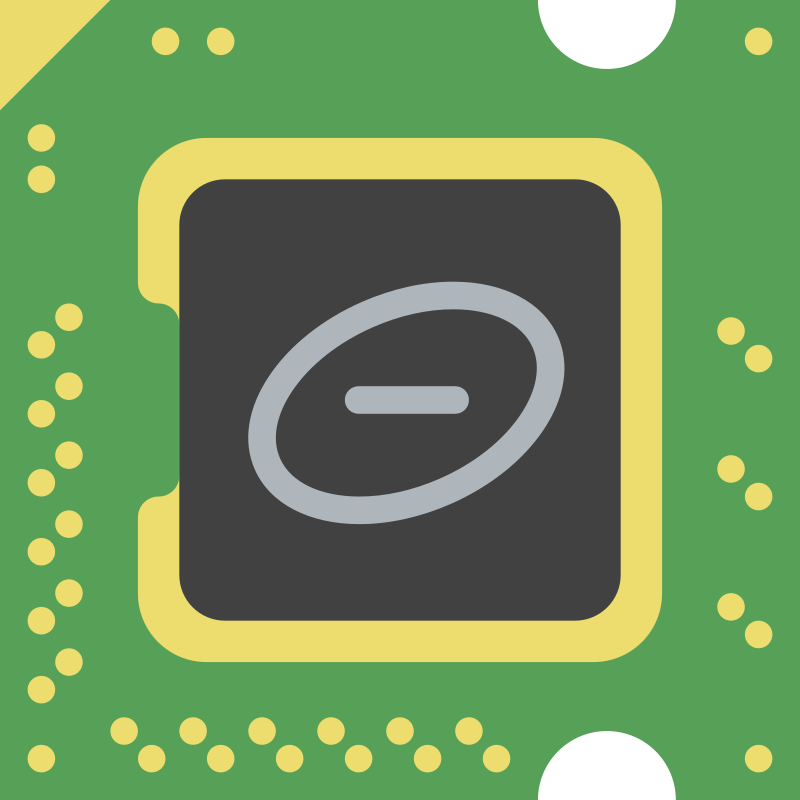

# NOVA34 Ultra Small Linux Board - Custom PCB Open Source 🚀
      

## Overview
This is an open-source headboard custom PCB designed in Altium for integration with the NXP MIMX8MN5DVPIZAA (I.MX 8M NANO - ULTRALIGHT 11x1MM 8nm). The board is designed to support essential peripherals such as eMMC storage, LPDDR4X RAM, WiFi/Bluetooth, camera module, and display. The design is optimized for performance and ease of assembly, with a compact form factor.

🎯 **The goal was to make it accessible to everyone—hobbyists, makers, robotics enthusiasts—without minimum order limitations.** This project follows the workflow of creating an SBC (Single Board Computer), robot board, and wearable device.

|  |  |
|----------------------------------------------------------|------------------------------------------------------|
###### Preview from Rev_1.3

## 🛠️ Technical Specifications
### 📏 Dimensions
- **Width:** 34mm  
- **Height:** 30.946mm  
- **Thickness:** 1mm  
### Primary Components

#### Back Side
* **NXP MIMX8MN5DVPIZAA** (I.MX 8M NANO - ULTRALIGHT 11x11mm)  
* **PMIC NXP PCA9450BHNY**  
* **Antenna M310220 Kyocera Avx**  
* **ADG824BCPZ-REEL7** (For Antenna Diversity)  
* **Camera 5MP** (Autofocus, 24Pins, around 110° FOV) 
* **Connector JST B4B-ZR-SM4-TF** (1.5mm, 1 Row, 4 Contacts) – Used for power input and serial communication; the same 4-pin header must be present on the new board.  
* **USB Pads for SDM** (Serial Download Mode for firmware flashing)  
* **Speaker Pads and External Speaker**  

###### Combo Chip:  
- **Rev_1.0 to Rev_1.3:** *(Realtek) RTL8723DS* (6x6mm Wi-Fi + Bluetooth)  
- **Final Revision:** *CYW43012* (Infineon)- 106-ball WLBGA (3.76 x 4.43mm; 0.35mm pitch)  
- **Storage:** *(Kingston) 32EP16-M4FTC32-GA68* (eMMC 5.1 HS400 + LPDDR4X 144-FBGA)  

#### Front Side
* **IMU BMI160** Bosch  
* **Display ST0103A2W-WSNLW-F** Santek  
* **NC7SP125P5X** Onsemi Fairchild
* **MAX98357AETE+T**  Analog Device

---

## 🔧 Design and PCB Progress  
#### Revision Notes

In **Rev_1.0 to Rev_1.3**, the process included several testing phases to assess the engineering validity of component research and selection.  

During this phase, we identified the **ADP191ACBZ-R7**, an ultra-compact high-side load switch. This component could be useful for managing power distribution efficiently, providing controlled power switching to different subsystems while offering short-circuit and overcurrent protection. However, based on the latest schematic, the **PMIC should already handle all power management efficiently, safely, and in a controlled manner**, making additional power switching unnecessary in most scenarios.  

Additionally, we replaced the **RTL8723DS (6x6mm)** combo-chip Wi-Fi/Bluetooth. Its footprint fit comfortably in the upper-right section of the back-side of the board. However, after further evaluation, we found a better and more compact alternative: the **CYW43012**, which offers improved efficiency and performance.  

Initially, we also considered the **AMA3B1KK-KBR-B0 (Apollo3 Blue)**, but in the end, we opted for the **CYW43012** as the best choice for this design. That said, we could still explore **future variants** incorporating different wireless solutions based on project needs.  

Placement and optimization trials were conducted, along with numerous other evaluations, successfully achieving the set objectives.  

Now, with the **final revision**, the **schematic is fully defined and accurate**, allowing for a more streamlined approach to PCB design in **High-Speed Design & Signal Integrity**.  

Now, with the **final revision**, the **schematic is fully defined and accurate**, allowing for a more streamlined approach to PCB design in **High-Speed Design & Signal Integrity**.

---

### Test Component Placements
| Top Signal | Top SilkScreen | Solder Mask |
|---------|---------|---------|
|  |  |  |  |

### Old Component Placements

#### Status:  
**Schematic:** ██████████ 100% (Complete)  
**PCB:** ███░░░░░░░░ 30% (In Progress)

---

## 📋 Component List & Costs (Prices may vary depending on the supplier, market trends or other reasons)
| **Componente**        | **Part Number**                          | **Price (€)**    |
|-----------------------|------------------------------------------|-------------------|
| **Processor**        | MIMX8MN5DVPIZAA  (NXP)                        | 24.29            |
| **Memory ePOP**      | 32EP16-M4FTC32-GA68    (KINGSTON)                 | 25.35            |
| **Connector**        | B4B-ZR-SM4-TF       (JST)                     | 0.66             |
| **PMIC**            | PCA9450BHNY     (NXP)                         | 4.11             |
| **IMU**             | BMI160 (BOSCH)                                   | 1.46             |
| **WiFi/Bluetooth**  | CYW43012TC0KFFBH  (Infineon Technologies)                       | 10.00            |
| **Antenna**         | M310220  (KYOCERA AVX)                                | 0.91             |
| **Display**        | ST0103A2W-WSNLW-F  (SANTEK DISPLAY SPECIALIST)                       | 31.84            |
| **DAC**            | MAX98357AETE+T (ANALOG DEVICE)                            | 4.50             |
| **External Speaker**| RS PRO 8Ω 0.5W Miniature Speaker 20mm (RS PRO)   | 15.00            |
| **RF SWITCH**      | ADG824BCPZ-REEL7 (ANALOG DEVICE)                         | 3.00             |
| **Buffer**    | NC7SP125P5X (Onsemi Fairchild)                                      | 0.70             |
| **Camera**         | 5MP MIPI Camera Module – MCM5M120M6F1 (IADY)   | 15.00 (USD)      |
| **PCB + Stencil**  | JLPCB                                   | 120-150          |
| **Estimated Total** | -                                        | ~261-291 € + 15 USD |

---
## 🚀 Getting Started  

### Requirements:
- Software: Altium Designer v24.6.1 or later. (Fully compatible with **MacOS via Parallels Desktop with Windows 11 ARM**).

1. **Download the Design Files**  
   - [GitHub Repository](https://github.com/silvioviscuso/nova34)  
   - Open Project group file (**.Nova.DsnWrk**)

2. **Schematics, Library and Netlist**  
   - At this stage, the **schematic files, library, and netlist** are fully completed and ready for review.  
   - The **PCB design is still in progress**, and full assembly instructions will be provided once completed.  

3. **Upcoming Documentation** *(to be released soon)*  
   - Complete **PCB assembly guide** for both factory production and **homemade/hobbyist assembly**.  
   - **List of required tools** for manual assembly.  
   - **Technical drawings** and reference materials.  
   - **Decals and labeling** for easy identification.  
   - Additional resources to streamline the build process.  
---
## 🤝 Contributing
This project is open-source, and contributions are welcome! You can help by:
- Suggesting improvements or fixes.
- Testing and documenting.
- Creating alternative designs or add-ons.

We encourage you to submit a pull request with your contributions to help improve the project!

### How to Submit a Pull Request
1. **Fork the repository** to your GitHub account.
2. **Create a new branch** dedicated to your revision (e.g., `Rev_1.4-fix-component-placement`).
3. **Make your changes** and ensure everything works as expected.
4. **Commit and push** your changes to your forked repository.
5. **Open a pull request** with a clear description of the modifications and improvements.

## ⭐ Star project and stay tuned for updates!
---
## 📜 License
This project is released under the **Creative Commons Attribution-NonCommercial 4.0 International (CC BY-NC 4.0) License**. You are free to modify and share the design, but **commercial use is not permitted**.

---
## 🔗 Other Similar Projects  

If you're interested in open-source compact boards and embedded devices, you might also find this project useful:  

 &nbsp; **[ESP32-REACTJS-DEVKIT](https://github.com/silvioviscuso/ESP32-REACTJS-DEVKIT)** – An **ultra-compact 35mm board** based on **ESP32-DOWDQ6 + 16MB**, perfect for IoT projects and ReactJS development.  

---

For any questions or discussions, feel free to open an issue on GitHub or contact me directly.